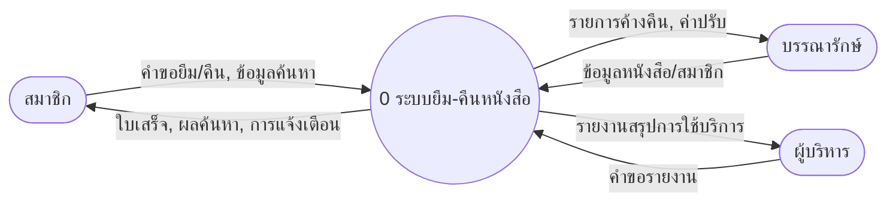
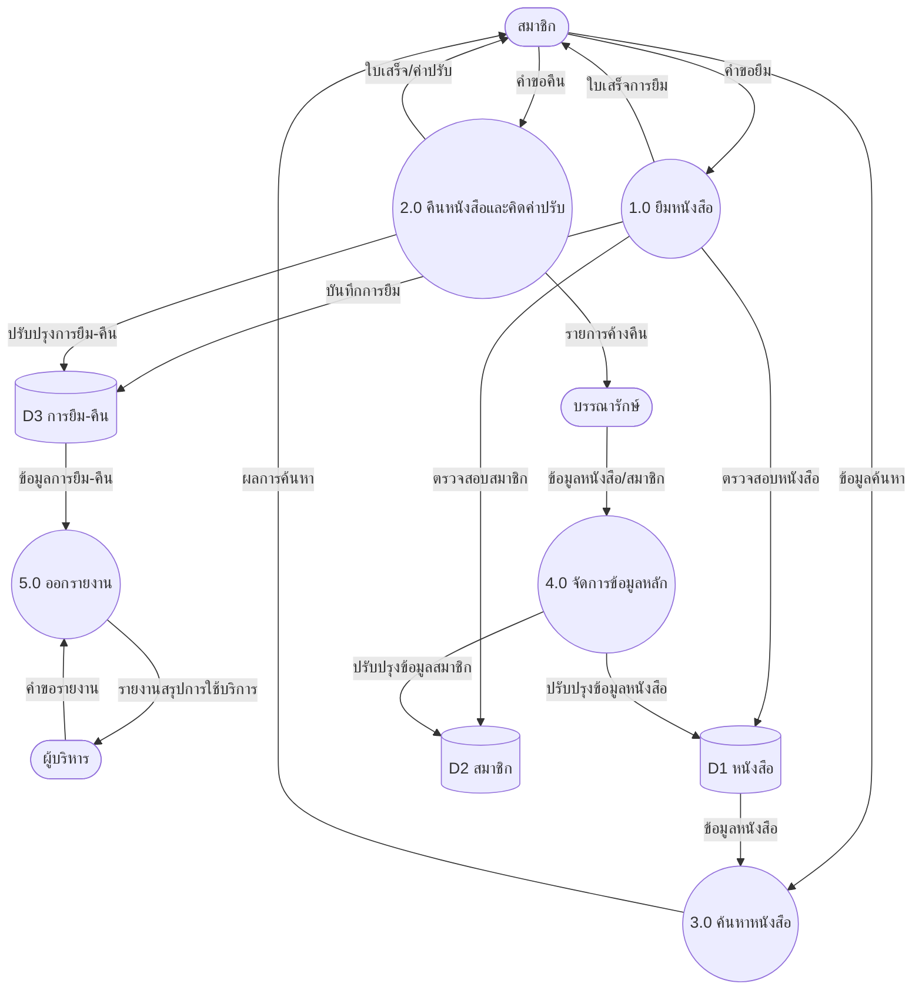

# ใบความรู้ที่ 5 — การสร้างแบบจำลองกระบวนการ (Data Flow Diagram)

| | |
|---|---|
| **รหัสวิชา** | 21909-1004 พื้นฐานการวิเคราะห์และออกแบบระบบ |
| **หน่วยที่** | 5 — การสร้างแบบจำลองกระบวนการ |
| **สอนครั้งที่** | 9–10 (ทฤษฎี 2 ชม. / ปฏิบัติ 6 ชม.) |
| **มาตรฐานอาชีพ** | สคช. รหัส 30101.02 อาชีพนักออกแบบและพัฒนาผลิตภัณฑ์ไอซีที ระดับ 3 |

---

## 1. ผลลัพธ์การเรียนรู้ระดับหน่วยการเรียน
ออกแบบและเขียนแผนภาพกระแสข้อมูล (Data Flow Diagram) เพื่อจำลองกระบวนการทำงานของระบบจากข้อกำหนดความต้องการได้อย่างถูกต้องตามหลักการ

## 2. สมรรถนะประจำหน่วย
1. แสดงความรู้เกี่ยวกับสัญลักษณ์และหลักการสร้างแบบจำลองกระบวนการ
2. ออกแบบและเขียนแผนภาพกระแสข้อมูล (DFD) ตามข้อกำหนดความต้องการ

## 3. จุดประสงค์เชิงพฤติกรรม
- **พุทธิพิสัย:** อธิบายสัญลักษณ์และหลักการเขียน DFD ได้ถูกต้อง
- **ทักษะพิสัย:** เขียน Context Diagram และ DFD Level 0/1 จากกรณีที่กำหนดได้ถูกต้อง
- **จิตพิสัย:** ทำงานประณีต เป็นระเบียบ และตรวจสอบความถูกต้องของผลงาน
- **ประยุกต์ใช้:** ประยุกต์ DFD ในการจำลองกระบวนการของระบบงานจริงได้

---

## 5. เนื้อหาสาระ

เมื่อได้ข้อกำหนดความต้องการของระบบแล้ว ขั้นต่อไปคือการนำความต้องการมา “จำลอง” ให้เห็นภาพการทำงานของระบบ เครื่องมือที่นิยมใช้คือ **แผนภาพกระแสข้อมูล (Data Flow Diagram: DFD)** ซึ่งแสดงการไหลของข้อมูลเข้า–ออก กระบวนการประมวลผล และแหล่งจัดเก็บข้อมูล ช่วยให้ทั้งนักวิเคราะห์ ผู้ใช้ และทีมพัฒนาเข้าใจระบบตรงกันก่อนลงมือออกแบบและเขียนโปรแกรม

### 5.1 ความหมายและประโยชน์ของแบบจำลองกระบวนการ
แบบจำลองกระบวนการ (Process Model) คือ การแสดงกระบวนการทำงานของระบบในรูปแบบภาพ เพื่อสื่อสารว่าระบบรับข้อมูลอะไร ประมวลผลอย่างไร และส่งผลลัพธ์ใดออกไป ประโยชน์สำคัญ ได้แก่ เข้าใจระบบได้ง่าย ตรวจสอบความครบถ้วนของกระบวนการ ลดความเข้าใจคลาดเคลื่อน และใช้เป็นพื้นฐานในการออกแบบระบบและฐานข้อมูล

### 5.2 สัญลักษณ์ของแผนภาพกระแสข้อมูล

| สัญลักษณ์ | องค์ประกอบ | ความหมายและการใช้งาน |
|---|---|---|
| วงกลม / สี่เหลี่ยมมุมมน | **กระบวนการ (Process)** | การประมวลผลที่แปลงข้อมูลเข้าเป็นข้อมูลออก ตั้งชื่อด้วยคำกริยา เช่น 1.0 ยืมหนังสือ |
| เส้นลูกศร → | **กระแสข้อมูล (Data Flow)** | ทิศทางการไหลของข้อมูล กำกับด้วยชื่อข้อมูล เช่น คำขอยืม |
| สี่เหลี่ยมเปิดด้านข้าง | **แหล่งจัดเก็บข้อมูล (Data Store)** | ที่เก็บข้อมูลของระบบ เช่น D1 หนังสือ (ใช้รหัส D นำหน้า) |
| สี่เหลี่ยม | **สิ่งที่อยู่ภายนอกระบบ (External Entity)** | ผู้ส่ง/รับข้อมูลที่อยู่นอกระบบ เช่น สมาชิก บรรณารักษ์ |

### 5.3 ระดับของ DFD
- **แผนภาพบริบท (Context Diagram):** แสดงระบบเป็นกระบวนการเดียว (หมายเลข 0) กับสิ่งที่อยู่ภายนอกระบบ ใช้กำหนดขอบเขต — *ไม่มีแหล่งจัดเก็บข้อมูล*
- **DFD ระดับ 0:** แตกกระบวนการหลักเป็นกระบวนการย่อย (1.0, 2.0, 3.0 …) และเริ่มแสดงแหล่งจัดเก็บข้อมูล
- **DFD ระดับ 1:** แตกรายละเอียดของกระบวนการย่อยแต่ละตัวให้ละเอียดยิ่งขึ้น (เช่น 1.1, 1.2)

### 5.4 ขั้นตอนการเขียน DFD
1. ระบุขอบเขตของระบบและสิ่งที่อยู่ภายนอก (External Entity)
2. ระบุข้อมูลเข้า–ออกระหว่างระบบกับสิ่งภายนอก แล้วเขียนแผนภาพบริบท
3. แตกกระบวนการหลักเป็นกระบวนการย่อยและกำหนดแหล่งจัดเก็บข้อมูล เขียนเป็น DFD ระดับ 0
4. แตกรายละเอียดกระบวนการที่ซับซ้อนเป็น DFD ระดับ 1 ตามความจำเป็น
5. ตรวจสอบความถูกต้องและความสมดุล (Balancing) ของทุกระดับ

### 5.5 หลักการและกฎการเขียน DFD ที่ถูกต้อง
- ตั้งชื่อกระบวนการด้วยคำกริยา + กรรม และตั้งชื่อกระแสข้อมูลให้สื่อความหมาย
- **ความสมดุล (Balancing):** ข้อมูลเข้า–ออกของกระบวนการแม่ต้องสอดคล้องกับข้อมูลเข้า–ออกรวมของกระบวนการย่อยในระดับถัดไป
- ทุกกระบวนการต้องมีทั้งข้อมูลเข้าและข้อมูลออก — หลีกเลี่ยง **“หลุมดำ” (มีเข้าไม่มีออก)** และ **“ปาฏิหาริย์” (มีออกไม่มีเข้า)**
- ข้อมูลไม่ไหลจาก store → store หรือ external → external โดยตรง โดยไม่ผ่านกระบวนการ
- ให้หมายเลขกระบวนการอย่างเป็นระบบ (0 → 1.0, 2.0 → 1.1, 1.2)

### 5.6 ข้อผิดพลาดที่พบบ่อย
กระบวนการที่เป็นหลุมดำหรือปาฏิหาริย์ · ลืมกำกับชื่อกระแสข้อมูล · แผนภาพไม่สมดุลระหว่างระดับ · ปนแหล่งจัดเก็บข้อมูลใน Context Diagram

---

### 5.7 ตัวอย่างการเขียน DFD : ระบบยืม–คืนหนังสือห้องสมุด

**(1) แผนภาพบริบท (Context Diagram)** — กำหนดขอบเขตของระบบและสิ่งที่อยู่ภายนอก

**(2) DFD ระดับ 0** — แตกกระบวนการหลักเป็นกระบวนการย่อย พร้อมแหล่งจัดเก็บข้อมูล D1 หนังสือ · D2 สมาชิก · D3 การยืม–คืน

**คำอธิบายสัญลักษณ์:** วงกลม = กระบวนการ · แคปซูล = สิ่งภายนอกระบบ · ทรงกระบอก = แหล่งจัดเก็บข้อมูล · ลูกศร = กระแสข้อมูล

| กระบวนการ | ข้อมูลเข้า (จาก) | ข้อมูลออก (ไป) | Data Store |
|---|---|---|---|
| 1.0 ยืมหนังสือ | คำขอยืม (สมาชิก) | ใบเสร็จการยืม (สมาชิก) | D1, D2, D3 |
| 2.0 คืนหนังสือและคิดค่าปรับ | คำขอคืน (สมาชิก) | ใบเสร็จ/ค่าปรับ (สมาชิก), รายการค้างคืน (บรรณารักษ์) | D1, D3 |
| 3.0 ค้นหาหนังสือ | ข้อมูลค้นหา (สมาชิก) | ผลการค้นหา (สมาชิก) | D1 |
| 4.0 จัดการข้อมูลหลัก | ข้อมูลหนังสือ/สมาชิก (บรรณารักษ์) | การยืนยันผล (บรรณารักษ์) | D1, D2 |
| 5.0 ออกรายงาน | คำขอรายงาน (ผู้บริหาร) | รายงานสรุปการใช้บริการ (ผู้บริหาร) | D3 |

---
4. หลุมดำ = กระบวนการที่มีข้อมูลเข้าแต่ไม่มีออก, ปาฏิหาริย์ = มีข้อมูลออกแต่ไม่มีเข้า ทั้งสองเป็นข้อผิดพลาดที่ต้องแก้ไข
5. ตัวอย่าง: สิ่งภายนอก = นักเรียน, อาจารย์ที่ปรึกษา, ฝ่ายทะเบียน; กระแสข้อมูลหลัก = ข้อมูลการลงทะเบียน, ผลการตรวจสอบ, ใบแจ้งผลการลงทะเบียน (คำตอบอาจต่างได้ตามเหตุผล)
