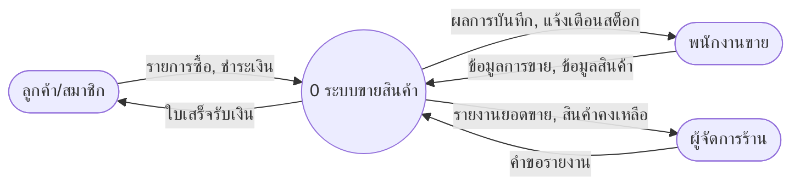
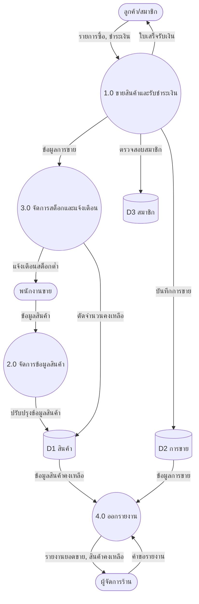

**กรณีศึกษา:** ระบบขายสินค้าร้านค้าสหกรณ์วิทยาลัย
**แหล่งจัดเก็บข้อมูล:** D1 สินค้า · D2 การขาย · D3 สมาชิก
> หมายเหตุ: เป็นแนวคำตอบตัวอย่าง คำตอบของนักเรียนอาจต่างได้หากสมเหตุสมผล

---

## กิจกรรมที่ 1 — สิ่งที่อยู่ภายนอกระบบและกระแสข้อมูล

| ลำดับ | สิ่งที่อยู่ภายนอกระบบ | ข้อมูลเข้าสู่ระบบ | ข้อมูลออกจากระบบ |
|:---:|---|---|---|
| 1 | ลูกค้า/สมาชิก | รายการซื้อ, การชำระเงิน | ใบเสร็จรับเงิน |
| 2 | พนักงานขาย | ข้อมูลการขาย, ข้อมูลสินค้า | ผลการบันทึก, การแจ้งเตือนสต็อก |
| 3 | ผู้จัดการร้าน | คำขอรายงาน | รายงานยอดขาย, รายงานสินค้าคงเหลือ |

---

## กิจกรรมที่ 2 — แผนภาพบริบท (Context Diagram)

---

## กิจกรรมที่ 3 — กระบวนการย่อยและแหล่งจัดเก็บข้อมูล

| หมายเลข | ชื่อกระบวนการ | แหล่งจัดเก็บข้อมูลที่ใช้ |
|:---:|---|---|
| 1.0 | ขายสินค้าและรับชำระเงิน | D1 สินค้า, D2 การขาย, D3 สมาชิก |
| 2.0 | จัดการข้อมูลสินค้า | D1 สินค้า |
| 3.0 | จัดการสต็อกและแจ้งเตือน | D1 สินค้า |
| 4.0 | ออกรายงาน | D1 สินค้า, D2 การขาย |

---

## กิจกรรมที่ 4 — แผนภาพกระแสข้อมูลระดับ 0 (DFD Level 0)

**คำอธิบายสัญลักษณ์:** วงกลม = กระบวนการ · แคปซูล = สิ่งภายนอกระบบ · ทรงกระบอก = แหล่งจัดเก็บข้อมูล · ลูกศร = กระแสข้อมูล

---

## กิจกรรมที่ 5 — ตรวจสอบความถูกต้อง

| รายการตรวจสอบ | ผล |
|---|:---:|
| ใช้สัญลักษณ์ DFD ครบทั้ง 4 ชนิด | ✔ |
| ตั้งชื่อกระบวนการด้วยคำกริยา + กำกับชื่อกระแสข้อมูลทุกเส้น | ✔ |
| ทุกกระบวนการมีทั้งข้อมูลเข้าและออก (ไม่มีหลุมดำ/ปาฏิหาริย์) | ✔ |
| ไม่มีข้อมูลไหล store→store หรือ external→external โดยตรง | ✔ |
| ข้อมูลเข้า–ออกของ DFD ระดับ 0 สมดุลกับแผนภาพบริบท (Balancing) | ✔ |

> **จุดสำคัญ:** กระบวนการ 3.0 รับ *ข้อมูลการขาย* จากกระบวนการ 1.0 (ไม่ใช่จากภายนอก) จึงไม่เป็น "ปาฏิหาริย์" — และกระแสข้อมูลเข้า/ออกที่เชื่อมกับสิ่งภายนอกทั้ง 3 ราย ตรงกับแผนภาพบริบทในกิจกรรมที่ 2
