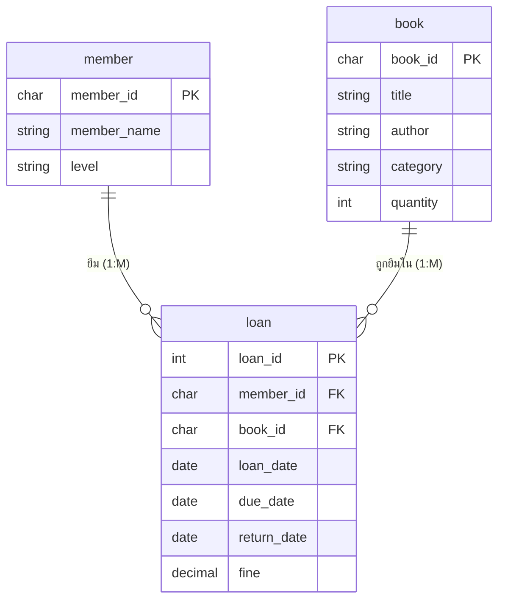

# ใบความรู้ที่ 6 — การสร้างแบบจำลองข้อมูล (Entity-Relationship Diagram)

**รหัสวิชา 21909-1004 พื้นฐานการวิเคราะห์และออกแบบระบบ · หน่วยที่ 6 · สอนครั้งที่ 11–12 (ท 2 / ป 6)**

> หลังจากจำลองกระบวนการทำงานของระบบด้วย DFD แล้ว แหล่งจัดเก็บข้อมูล (Data Store) ที่ปรากฏจะถูกนำมาออกแบบโครงสร้างข้อมูลอย่างละเอียด เครื่องมือที่ใช้คือ **แผนภาพความสัมพันธ์ระหว่างข้อมูล (E-R Diagram)** ซึ่งเป็นพื้นฐานสำคัญของการออกแบบฐานข้อมูลเชิงสัมพันธ์

---

## เนื้อหาสาระ

### 6.1 ความหมายและประโยชน์ของแบบจำลองข้อมูล
แบบจำลองข้อมูล (Data Model) คือ การแสดงโครงสร้างและความสัมพันธ์ของข้อมูลในระบบในรูปแบบภาพ ช่วยให้เข้าใจว่าระบบต้องจัดเก็บข้อมูลอะไรบ้าง ข้อมูลแต่ละชุดสัมพันธ์กันอย่างไร **ลดความซ้ำซ้อนของข้อมูล** และเป็นพิมพ์เขียวในการสร้างฐานข้อมูลจริง

### 6.2 องค์ประกอบและสัญลักษณ์ของ E-R Diagram

| สัญลักษณ์ | องค์ประกอบ | ความหมาย |
|---|---|---|
| สี่เหลี่ยม | **เอนทิตี (Entity)** | สิ่งที่ต้องจัดเก็บข้อมูล เช่น สมาชิก หนังสือ การยืม–คืน |
| วงรี | **แอตทริบิวต์ (Attribute)** | คุณสมบัติของเอนทิตี เช่น รหัสสมาชิก ชื่อ–สกุล |
| สี่เหลี่ยมข้าวหลามตัด | **ความสัมพันธ์ (Relationship)** | การเชื่อมโยงระหว่างเอนทิตี เช่น สมาชิก “ยืม” หนังสือ |
| ขีดเส้นใต้ | **คีย์หลัก (Primary Key)** | แอตทริบิวต์ที่ระบุข้อมูลแต่ละรายการอย่างไม่ซ้ำกัน |

### 6.3 ประเภทของแอตทริบิวต์ (Attribute)
- **อย่างง่าย (Simple):** แบ่งย่อยไม่ได้ เช่น อายุ
- **ผสม (Composite):** แบ่งย่อยได้ เช่น ชื่อ–สกุล (ชื่อ + นามสกุล)
- **หลายค่า (Multivalued):** มีได้หลายค่า เช่น เบอร์โทรศัพท์
- **คำนวณได้ (Derived):** คำนวณจากค่าอื่น เช่น ค่าปรับ (จากจำนวนวันเกินกำหนด)

### 6.4 คีย์ (Key)
- **คีย์หลัก (Primary Key):** ใช้ระบุข้อมูลแต่ละแถวอย่างไม่ซ้ำกัน
- **คีย์คู่แข่ง (Candidate Key):** แอตทริบิวต์ที่มีคุณสมบัติเป็นคีย์หลักได้
- **คีย์นอก (Foreign Key):** ใช้เชื่อมความสัมพันธ์ไปยังคีย์หลักของอีกเอนทิตี

### 6.5 ความสัมพันธ์และคาร์ดินาลิตี (Cardinality)

| รูปแบบ | ความหมาย | ตัวอย่าง |
|---|---|---|
| **1 : 1** | 1 รายการสัมพันธ์กับอีกฝั่งเพียง 1 รายการ | นักเรียน 1 คน มีบัตรประจำตัว 1 ใบ |
| **1 : M** | 1 รายการสัมพันธ์กับอีกฝั่งได้หลายรายการ | สมาชิก 1 คน ยืมได้หลายครั้ง |
| **M : N** | ทั้งสองฝั่งสัมพันธ์กันได้หลายรายการ | หนังสือหลายเล่ม ถูกยืมโดยสมาชิกหลายคน |

> ความสัมพันธ์แบบ **M : N สร้างเป็นตารางโดยตรงไม่ได้** ต้องแยกเป็น **เอนทิตีเชื่อม (Associative Entity)** เช่น แยกความสัมพันธ์ระหว่าง *สมาชิก* กับ *หนังสือ* ออกเป็นเอนทิตี **“การยืม–คืน”** ที่เก็บคีย์นอกของทั้งสองฝั่ง

### 6.6 ขั้นตอนการเขียน E-R Diagram
1. ระบุเอนทิตีจากแหล่งจัดเก็บข้อมูลใน DFD และคำอธิบายความต้องการ
2. กำหนดแอตทริบิวต์และคีย์หลักของแต่ละเอนทิตี
3. ระบุความสัมพันธ์ระหว่างเอนทิตีและกำหนดคาร์ดินาลิตี
4. แปลงความสัมพันธ์ M : N เป็นเอนทิตีเชื่อม
5. ตรวจสอบความครบถ้วนและความถูกต้องของแผนภาพ

### 6.7 พจนานุกรมข้อมูล (Data Dictionary)
บันทึกรายละเอียดของข้อมูลแต่ละรายการเพื่อใช้อ้างอิงในการสร้างฐานข้อมูล โดยทั่วไปประกอบด้วย **ชื่อฟิลด์ · ชนิดข้อมูล · ขนาด · ประเภทคีย์ · คำอธิบาย**

### 6.8 การแปลง E-R Diagram เป็นตารางฐานข้อมูล
- เอนทิตีแต่ละตัวแปลงเป็น 1 ตาราง แอตทริบิวต์กลายเป็นฟิลด์ และคีย์หลักเป็น Primary Key
- ความสัมพันธ์ **1 : M** ใส่คีย์หลักของฝั่ง “หนึ่ง” ไปเป็นคีย์นอกในฝั่ง “กลุ่ม”
- ความสัมพันธ์ **M : N** สร้างตารางใหม่ (เอนทิตีเชื่อม) ที่มีคีย์นอกของทั้งสองฝั่ง
- จัดข้อมูลให้เป็นรูปแบบบรรทัดฐาน (Normalization 1NF–3NF) เพื่อลดความซ้ำซ้อน

---

### 6.9 ตัวอย่างการเขียน E-R Diagram : ระบบยืม–คืนหนังสือห้องสมุด

ความสัมพันธ์ M : N ระหว่าง *สมาชิก* กับ *หนังสือ* ถูกแยกเป็นเอนทิตีเชื่อม **“การยืม–คืน (loan)”**

**พจนานุกรมข้อมูล — เอนทิตี การยืม–คืน (loan)**

| ชื่อฟิลด์ | ชนิดข้อมูล | ขนาด | คีย์ | คำอธิบาย |
|---|---|:---:|:---:|---|
| loan_id | Integer | - | PK | รหัสการยืม (ไม่ซ้ำ) |
| member_id | Char | 8 | FK | รหัสสมาชิกผู้ยืม |
| book_id | Char | 10 | FK | รหัสหนังสือที่ยืม |
| loan_date | Date | - | - | วันที่ยืม |
| due_date | Date | - | - | กำหนดวันคืน |
| return_date | Date | - | - | วันที่คืนจริง |
| fine | Decimal | 8,2 | - | ค่าปรับ (คำนวณจากวันเกินกำหนด) |

**โครงสร้างตารางฐานข้อมูลที่ได้** (PK ขีดเส้นใต้ / FK = คีย์นอก)
- **member** ( <u>member_id</u>, member_name, level, phone )
- **book** ( <u>book_id</u>, title, author, category, quantity )
- **loan** ( <u>loan_id</u>, member_id *(FK)*, book_id *(FK)*, loan_date, due_date, return_date, fine )

---

## สรุปสาระสำคัญ
การสร้างแบบจำลองข้อมูลด้วย E-R Diagram เริ่มจากระบุ **เอนทิตี → แอตทริบิวต์/คีย์ → ความสัมพันธ์/คาร์ดินาลิตี** จากนั้นแยกความสัมพันธ์ **M : N** เป็นเอนทิตีเชื่อม แล้วจึงแปลงเป็นตารางฐานข้อมูลพร้อมทำ Normalization โดยมีพจนานุกรมข้อมูลกำกับรายละเอียดของทุกฟิลด์ เพื่อให้ได้โครงสร้างฐานข้อมูลที่ถูกต้อง ครบถ้วน และไม่ซ้ำซ้อน
