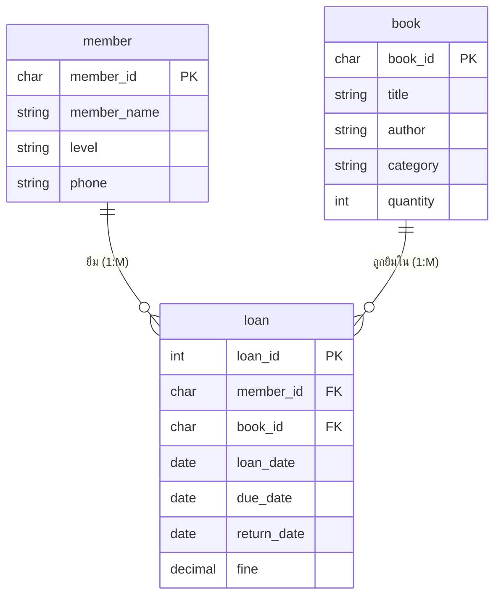

# LAB06 การสร้างแบบจำลองข้อมูล (Entity-Relationship Diagram)

**กรณีศึกษา:** ระบบยืม–คืนหนังสือห้องสมุดวิทยาลัย
**แหล่งจัดเก็บข้อมูล (จาก DFD):** D1 สมาชิก · D2 หนังสือ · D3 การยืม–คืน
> หมายเหตุ: เป็นแนวคำตอบตัวอย่าง คำตอบของนักเรียนอาจต่างได้หากสมเหตุสมผล

---

## กิจกรรมที่ 1 — ระบุเอนทิตีและแอตทริบิวต์

ระบุเอนทิตีจากแหล่งจัดเก็บข้อมูลใน DFD และคำอธิบายความต้องการของระบบ พร้อมกำหนดแอตทริบิวต์และคีย์หลักของแต่ละเอนทิตี

| เอนทิตี | คีย์หลัก (PK) | แอตทริบิวต์อื่น |
|---|---|---|
| สมาชิก (member) | member_id | member_name, level, phone |
| หนังสือ (book) | book_id | title, author, category, quantity |
| การยืม–คืน (loan) | loan_id | member_id (FK), book_id (FK), loan_date, due_date, return_date, fine |

---

## กิจกรรมที่ 2 — ระบุความสัมพันธ์และคาร์ดินาลิตี

วิเคราะห์ความสัมพันธ์ระหว่างเอนทิตีและกำหนดประเภทของคาร์ดินาลิตี

| ความสัมพันธ์ | เอนทิตีที่ 1 | เอนทิตีที่ 2 | คาร์ดินาลิตี | เหตุผล |
|---|---|---|:---:|---|
| ยืม | สมาชิก (member) | การยืม–คืน (loan) | 1 : M | สมาชิก 1 คน ยืมได้หลายครั้ง |
| ถูกยืมใน | หนังสือ (book) | การยืม–คืน (loan) | 1 : M | หนังสือ 1 เล่ม ถูกยืมได้หลายครั้ง |

> **หมายเหตุ:** ความสัมพันธ์ระหว่าง *สมาชิก* กับ *หนังสือ* เดิมเป็นแบบ **M : N** (สมาชิกหลายคนยืมหนังสือหลายเล่มได้) จึงต้องแยกเป็น **เอนทิตีเชื่อม "การยืม–คืน (loan)"** เพื่อให้สามารถสร้างตารางฐานข้อมูลได้

---

## กิจกรรมที่ 3 — แผนภาพ E-R Diagram

**คำอธิบายสัญลักษณ์:** สี่เหลี่ยม = เอนทิตี · วงรี = แอตทริบิวต์ · เส้นเชื่อม = ความสัมพันธ์ · ขีดเส้นใต้ = คีย์หลัก

---

## กิจกรรมที่ 4 — พจนานุกรมข้อมูล (Data Dictionary)

### เอนทิตี สมาชิก (member)

| ชื่อฟิลด์ | ชนิดข้อมูล | ขนาด | คีย์ | คำอธิบาย |
|---|---|:---:|:---:|---|
| member_id | Char | 8 | PK | รหัสสมาชิก (ไม่ซ้ำ) |
| member_name | VarChar | 100 | - | ชื่อ–นามสกุลสมาชิก |
| level | VarChar | 20 | - | ระดับชั้น/ประเภทสมาชิก |
| phone | VarChar | 15 | - | เบอร์โทรศัพท์ |

### เอนทิตี หนังสือ (book)

| ชื่อฟิลด์ | ชนิดข้อมูล | ขนาด | คีย์ | คำอธิบาย |
|---|---|:---:|:---:|---|
| book_id | Char | 10 | PK | รหัสหนังสือ (ไม่ซ้ำ) |
| title | VarChar | 200 | - | ชื่อหนังสือ |
| author | VarChar | 100 | - | ชื่อผู้แต่ง |
| category | VarChar | 50 | - | หมวดหมู่หนังสือ |
| quantity | Integer | - | - | จำนวนหนังสือคงเหลือ |

### เอนทิตี การยืม–คืน (loan)

| ชื่อฟิลด์ | ชนิดข้อมูล | ขนาด | คีย์ | คำอธิบาย |
|---|---|:---:|:---:|---|
| loan_id | Integer | - | PK | รหัสการยืม (ไม่ซ้ำ) |
| member_id | Char | 8 | FK | รหัสสมาชิกผู้ยืม |
| book_id | Char | 10 | FK | รหัสหนังสือที่ยืม |
| loan_date | Date | - | - | วันที่ยืม |
| due_date | Date | - | - | กำหนดวันคืน |
| return_date | Date | - | - | วันที่คืนจริง |
| fine | Decimal | 8,2 | - | ค่าปรับ (คำนวณจากวันเกินกำหนด) |

---

## กิจกรรมที่ 5 — โครงสร้างตารางฐานข้อมูล

แปลง E-R Diagram เป็นตารางฐานข้อมูลเชิงสัมพันธ์ (PK ขีดเส้นใต้ / FK = คีย์นอก)

- **member** ( <u>member_id</u>, member_name, level, phone )
- **book** ( <u>book_id</u>, title, author, category, quantity )
- **loan** ( <u>loan_id</u>, member_id *(FK)*, book_id *(FK)*, loan_date, due_date, return_date, fine )

---

## กิจกรรมที่ 6 — ตรวจสอบความถูกต้อง

| รายการตรวจสอบ | ผล |
|---|:---:|
| ระบุเอนทิตีครบตามแหล่งจัดเก็บข้อมูลใน DFD | ✔ |
| ทุกเอนทิตีมีคีย์หลัก (Primary Key) ที่ไม่ซ้ำกัน | ✔ |
| ระบุคาร์ดินาลิตีของทุกความสัมพันธ์ถูกต้อง | ✔ |
| แปลงความสัมพันธ์ M : N เป็นเอนทิตีเชื่อมเรียบร้อยแล้ว | ✔ |
| คีย์นอก (Foreign Key) ในเอนทิตีเชื่อมอ้างอิงคีย์หลักของทั้งสองฝั่ง | ✔ |
| พจนานุกรมข้อมูลบันทึกรายละเอียดครบทุกฟิลด์ | ✔ |

> **จุดสำคัญ:** เอนทิตี *การยืม–คืน (loan)* ทำหน้าที่เป็น **เอนทิตีเชื่อม** ที่แก้ปัญหาความสัมพันธ์ M : N ระหว่าง *สมาชิก* กับ *หนังสือ* โดยเก็บ `member_id` และ `book_id` เป็นคีย์นอก และแอตทริบิวต์ `fine` เป็น **Derived Attribute** ที่คำนวณได้จากผลต่างของ `return_date` กับ `due_date`
